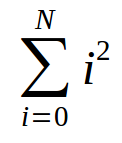

<meta http-equiv="Content-Type" content="text/html; charset=UTF-8"/></p>        

Roteiro 4: Repetição (2)
========================

<!--
- Fazer todos os itens em um único arquivo, ex., `lab-04.py`.
- Ao final, enviar um e-mail da seguinte forma:
    - *Para*: `francisco@ime.uerj.br`
    - Enviar uma cópia para o seu e-mail.
      **Ao desligar, todos os arquivos são removidos do computador.**
    - *Assunto*: IPD, lab-04, João da Silva
    - *Anexos*:
        - `lab-04.py`
        - Para cada item, um *print screen* da tela de edição e outro da tela de execução
    - *Corpo*: Enumerar os exercícios que foram e não foram feitos, ex.:

```
Sim: 1 ao 3
Não: 4
Seguem arquivos em anexo...
```
-->

## 1.

Faça um programa que leia números continuamente até que seja digitado `0`.
Ao final, o programa deve exibir o maior valor e quantas vezes esse valor foi
digitado.

## 2.

Faça um programa que leia um número `N` e calcule o somatório a seguir:



## 3.

Um jogo de *Adivinha!* funciona da seguinte forma:

- Em cada rodada, o *mestre* escolhe um número qualquer.
- Em seguida, o jogador tenta adivinhar o número.
- Se o jogador acertar o número do mestre, ele marca 10 pontos.
- Se o jogador errar com uma diferença de até 2, ele marca 5 pontos.
- São 5 rodadas

Faça um programa que leia os números do mestre e do jogador alternadamente
(durante as 5 rodadas) e escreva na tela o total de pontos somados.
Assuma que só serão digitados números entre 0 e 9.

## 4.

(Igual ao do laboratório 3.)

Considere o programa a seguir:

```
n1 = input()
n2 = input()
n3 = input()
while n1 > 0:
    print "n2", n2
    v = n3
    while v > 0:
        n2 = n2 + 1
        v = v - 1
    n1 = n1 - 1
```

Considere que o usuário digitou os seguintes valores para o programa acima:

```
# Entrada de Dados
3
10
5
```

Usando a funcionalidade de *Debug -> Debugger*, transcreva o estado da memória
(conteúdo das variáveis) e saída na tela (efeito dos `print`).

A simulação para a primeira linha já está transcrita a seguir:

```
# Estado da Memória
# Variável valor1 valor2 valor3 ...
# -------- ------ ------ ------
  n1            3


```

```
# Tela do Computador
# ------------------


```

O que o programa está fazendo? Descreva "em bom português" o significado do
programa.                          
Em outras palavras, explique o que o programa está calculando.
